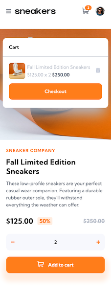
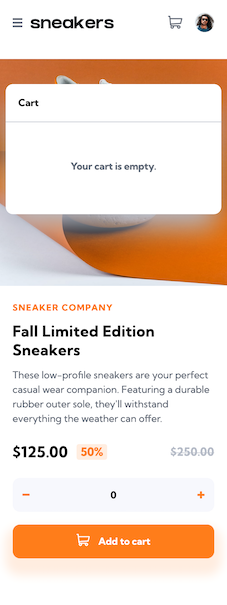

# Frontend Mentor - E-commerce product page solution

This is a solution to the [E-commerce product page challenge on Frontend Mentor](https://www.frontendmentor.io/challenges/ecommerce-product-page-UPsZ9MJp6). Frontend Mentor challenges help you improve your coding skills by building realistic projects.

## Table of contents

- [Overview](#overview)
  - [The challenge](#the-challenge)
  - [Screenshot](#screenshot)
  - [Links](#links)
- [My process](#my-process)
  - [Built with](#built-with)
  - [What I learned](#what-i-learned)
  - [Continued development](#continued-development)
  - [Useful resources](#useful-resources)
- [Author](#author)

## Overview

Product page of a single product with functional shopping cart and carrousel and lightbox feature.

### The challenge

Users should be able to:

- View the optimal layout for the site depending on their device's screen size
- See hover states for all interactive elements on the page
- Open a lightbox gallery by clicking on the large product image
- Switch the large product image by clicking on the small thumbnail images
- Add items to the cart
- View the cart and remove items from it

### Screenshot

### Links

- Solution URL: [GitHub Page](https://github.com/MCDoodle1/ecommerce-productpage)
- Live Site URL: [Rest Countries API Live Site](https://mcdoodle1.github.io/ecommerce-productpage/)

## My process

I started by writing the HTML and decided on layout and divisons in components. Then I wrote the React functionality for the menu, cart, lightbox and buttons and finally the CSS to style the page. 

### Built with

- CSS custom properties
- Flexbox
- CSS Grid
- Responsive design
- [BEM](https://en.bem.info/methodology/css/) - BEM Methodology
- [React](https://reactjs.org/) - JS library
- [Sass](https://sass-lang.com) - Sass documentation

### What I learned

This was my first time to code a shopping cart in React. 

### Continued development

Design a commercial webpage with multiple items that gets its data from an API, including a functioning login and payment page.

### Useful resources

- [Mastering React Carousel: Building Dynamic Image Sliders](https://blog.stackademic.com/mastering-react-carousel-building-dynamic-image-sliders-ee6089580152) - Article about building carrousels in React

## Author

- Website - [Marco Clarijs](https://github.com/MCDoodle1)
- Frontend Mentor - [@MCDoodle1](https://www.frontendmentor.io/profile/MCDoodle1)